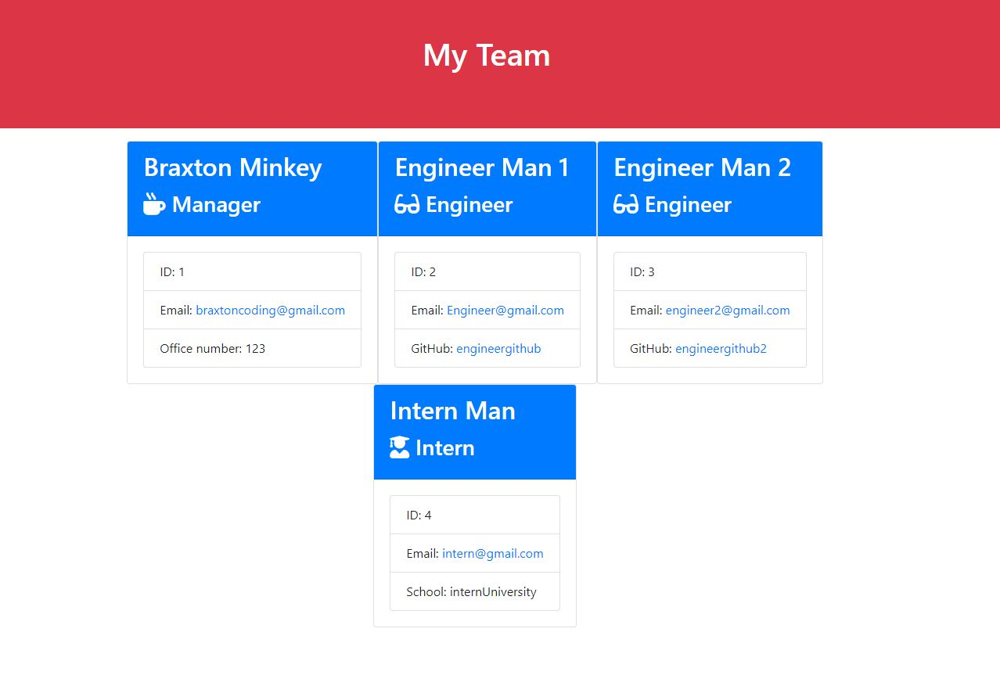

# Braxton M | UCBC10_TeamProfileGenerator | README

The objective of the Team Profile Generator Node.js command-line application to allow a manager to create a on the site cards that are generated based upon adding team members within the command line.
The manager is able to add engineers and interns with their respective questions. Engineers are asked for their github username and interns are asked for their school they have attended 


The application was not given starter code


## Acceptance Criteria


```
GIVEN a note-taking application
WHEN I open the Note Taker
THEN I am presented with a landing page with a link to a notes page
WHEN I click on the link to the notes page
THEN I am presented with a page with existing notes listed in the left-hand column, plus empty fields to enter a new note title and the note’s text in the right-hand column
WHEN I enter a new note title and the note’s text
THEN a Save icon appears in the navigation at the top of the page
WHEN I click on the Save icon
THEN the new note I have entered is saved and appears in the left-hand column with the other existing notes
WHEN I click on an existing note in the list in the left-hand column
THEN that note appears in the right-hand column
WHEN I click on the Write icon in the navigation at the top of the page
THEN I am presented with empty fields to enter a new note title and the note’s text in the right-hand column
```


## Screenshot

Screenshot of the Application

* Screenshot 1: Landing Page



## Assignment Links

- [Video Tutorial](https://drive.google.com/file/d/1bs-EXAFW8Wm5wA5XZ9F50OUzJnZkKh4L/view)
- [Github Project Repository](UCBC10_TeamProfileGenerator)

##  Contributors / Resouces Used
    
UC Berkley Tutoring 

Ishwardeep Singh Anand - [Github](https://github.com/ianad389)


